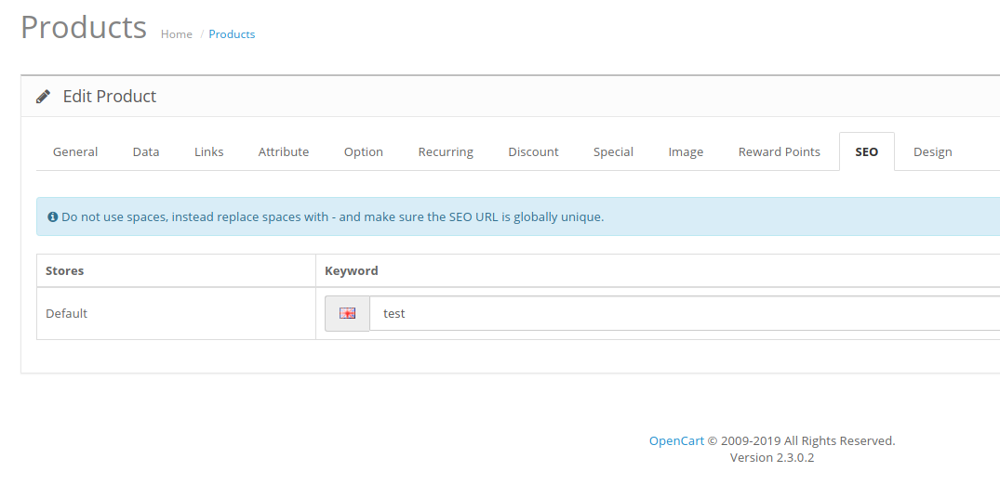
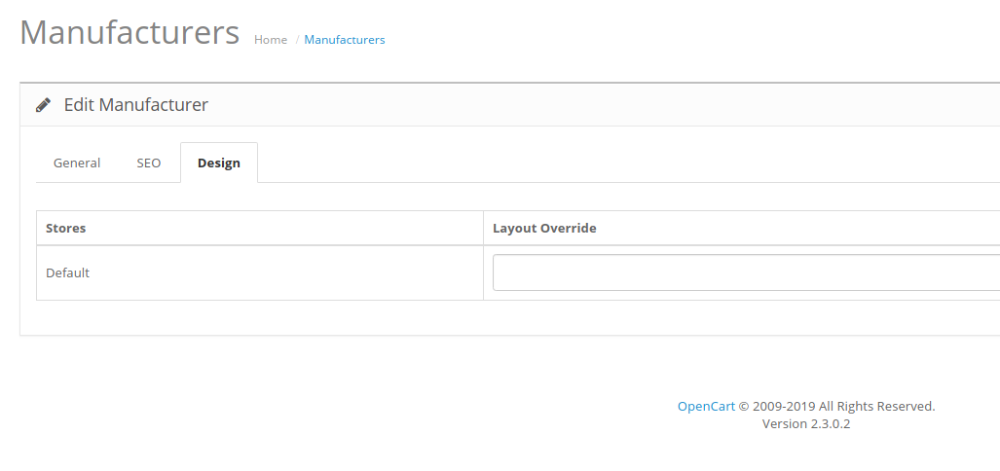
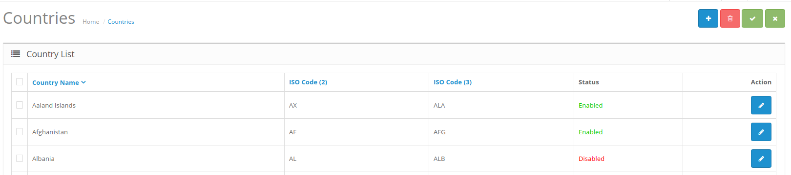
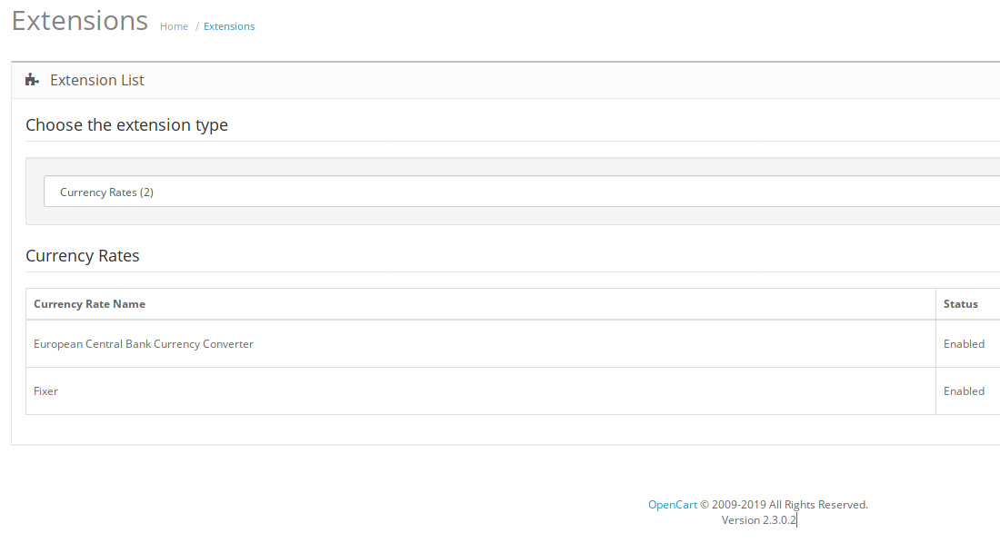
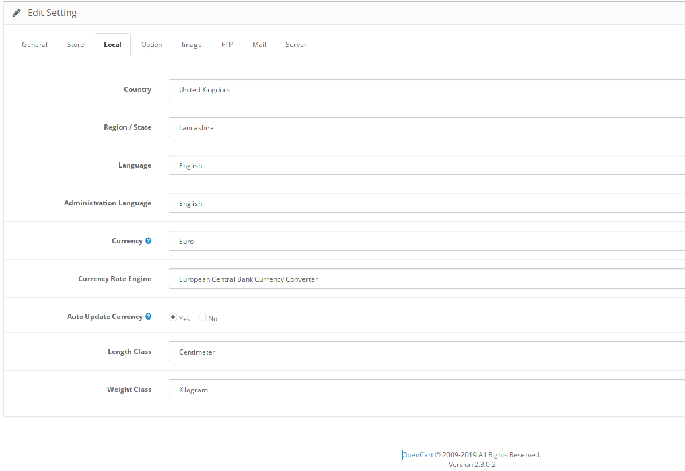
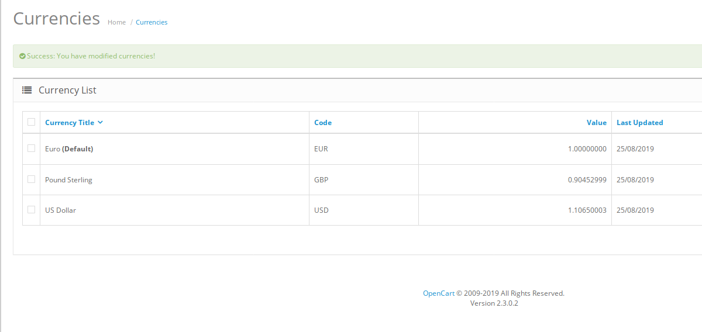

# OpenCart 2.3.0.2 Modified Version

## Added

- Bugs fix added
- SEO URL from v3.0.2.0
- Manufacturer Layout Override
- PHP 7 Support
- Pagination Fix
- Added Summernote Images Attributes
- Added Summernote Font size
- Manufacturer Description
- Manufacturer Meta Tag Title
- Manufacturer Meta Tag Description
- Manufacturer Meta Tag Keywords
- Added option to enable/disable one country or more
- Added currency update from 3.1.0.0b

# Screenshots

